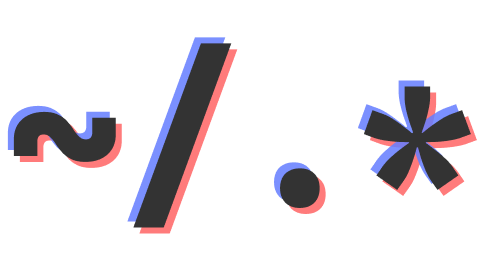

<p align="center">
  
</p>

<h1 align="center">~/.dotfiles</h1>

Personal dotfiles to keep the important configurations whenever I change the
OS. Currently using macOs devices, therefore the `main` branch contains the
configurations for such devices.

> Note that the other branches may not be as maintained nor up to date as the
> `main` branch.

## Set up

You can run the `./setup.sh` script which will initialise the OS by adding the
moving the pacakges. It uses `stow`, therefore make sure it is installed. It
requires other packages, such as `zsh`, `git`, `nvim` and `curl`. In case one of
the dependencies it is not found, the execution will stop.  
It installs `nvm` as a `node` and `npm` version manager, but it can easily be
removed by removing the `$HOME/.nvm` folder.

> As soon as possible, the script will be migrated to a `lua` script in order to
provide a more customizable installation.

## fish && kitty

Even though there's the `zsh` configuration available, the main shell that I use
is [fish](fishshell.com). Since I have switched from `zsh`, I have been ejoying
it more than any other. In combination with `kitty`, I consider to have a great,
fast, customizable and performant workflow environment.  
As well as installing `fish`, the `./setup.sh` script will also install the
[`fisher`](https://git.io/fisher) plugin manager. With it, I recommend
installing the following plugins:

- `plugin-kubectl`: adds simliar aliases as the kubectl plugin for zsh.

> Completions can be installed from most executables (`gh`, `cargo`, `volta`...)
> and should be stored in `~/.config/fish/completions/<exec-name>.fish`.  
> Docker does not provide a `completion(s)` command. Use the following command
> to run:

```sh
curl -sS https://raw.githubusercontent.com/docker/cli/master/contrib/completion/fish/docker.fish \
  > .config/fish/completions/docker.fish
```

## Starship

I have been using powerlevel10k to customize my `zsh`, it was very complex to
port to `fish`. Using `starship`, I have a shared prompt configuration. Since it
is exclusively for the prompt, it does not include any sort of plugin
configuration.

> Configuration can be found in `./starship/.config/starship.toml`.

## Neovim

The Neovim configuration is built upon
[`NvChad`](https://github.com/NvChad/NvChad). It adds a couple of plugins to
deal with formmating and the required configurations for the LSP server.

> You can find and modify LSP configurations in the 
> [NvChad custom config folder](./nvim/.config/nvim/lua/custom/plugins).

Currently, the LSP is set up for:

- Bash (it has a very simple completion).
- Docker
- Go
- Rust
- JavaScript, Typescript and TailwindCSS
- Yaml (including k8s), JSON

It includes diagnostics as well as formatting for each LSP. All required LSP are
installed through the Mason plugin, meaning they will all be installed on
lauching `MasonInstallAll`. Same for TreeSitter language highlightings, which
has defined the required languages.

> You can modify the formatting options in the 
> [`formatter.lua`](./nvim/.config/nvim/lua/custom/plugins/user/formatter.lua).

Currently using a minimally modified [NvChad](https://github.com/NvChad/NvChad)
set up. The goal is to add the plugins required in order to make it fully
functional both for front and back end development.
